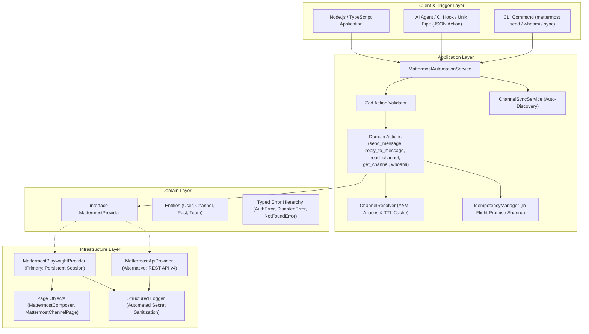

<div align="center">

# Mattermost Personal Account Automation

**Production-grade, modular automation service and CLI for interacting with Mattermost using your personal identity.**

[](https://www.typescriptlang.org/)
[](https://nodejs.org/)
[](https://vitest.dev/)
[](https://playwright.dev/)
[](https://opensource.org/licenses/MIT)

<p align="center">
  <a href="#-why-this-exists">Why This Exists</a> •
  <a href="#-architecture">Architecture</a> •
  <a href="#-features">Features</a> •
  <a href="#-quick-start">Quick Start</a> •
  <a href="#-yaml-channel-mapping">Channel Mapping</a> •
  <a href="#-cli-reference">CLI Reference</a> •
  <a href="#-typescript-sdk">TypeScript SDK</a> •
  <a href="#-security">Security</a> •
  <a href="#-testing">Testing</a>
</p>

</div>

---

## 💡 Why This Exists

Most Mattermost automation tools rely on **Incoming Webhooks**, **Bot Accounts**, or **Personal Access Tokens (PAT)**. In corporate and enterprise environments, this presents major blockers:

1. **Permission Friction (Not Everyone is an Admin)**: Regular team members cannot generate Personal Access Tokens or create webhooks arbitrarily because workspace policies restrict these to administrators.
2. **Identity Attribution**: Messages sent via bot accounts or incoming webhooks look like impersonal bots, stripping away personal responsibility and developer context (e.g. who made the PR or deployed the fix).
3. **SSO & MFA Obstacles**: Corporate instances often require Google Workspace / Okta / SAML login with MFA, which standard script-based HTTP bots cannot bypass without administrative API tokens.

**Mattermost Personal Account Automation** solves this by prioritizing a **Zero-Admin Browser Automation Layer (Playwright)** as the primary default strategy, with direct API support as a fast alternative:

* **🌟 Strategy 1 — Persistent Browser Context (Playwright — Primary & Default)**:
  * Zero admin privileges required.
  * Works for **any** corporate user with a standard Mattermost account.
  * Full support for SSO (Google, Okta, GitLab, SAML) and Multi-Factor Authentication (MFA).
  * You log in manually once via `npm run cli -- login`. The session is securely saved locally and reused headless.
* **⚡ Strategy 2 — REST API v4 (Personal Access Tokens — Optional Alternative)**:
  * For power users or environments where Personal Access Tokens are explicitly permitted.

---

## 🏗 Architecture

The system enforces strict separation of concerns across Domain, Infrastructure, Application, and Client layers:



---

## ✨ Features

| Feature | Description |
| :--- | :--- |
| **Zero-Admin Setup** | Uses persistent Playwright session by default so standard non-admin users can automate without tokens or webhook creation. |
| **Personal Account Attribution** | All posts, replies, and channel operations appear authentically as your personal Mattermost user. |
| **Auto Channel Discovery** | Auto-discovers all channels across teams on login and generates `channels.yml` with `enabled: true/false` toggles. |
| **Dual Provider Support** | Primary Playwright provider + optional high-speed REST API v4 provider via configuration switch. |
| **Smart Channel Resolution** | Accepts channel names (`engineering`), YAML aliases (`backend-dev`), slugs (`~engineering`), or 26-char IDs. |
| **Idempotency & Deduplication** | In-flight execution lock and cached response store prevents duplicate messages during retry storms. |
| **Identity Verification Lock** | Startup self-check verifies identity against `MATTERMOST_EXPECTED_USER_ID`, preventing unintended execution. |
| **Zero Credential Leaks** | Automated regex scrubbing masks Bearer tokens, cookies, passwords, and session data in logs, errors, and CLI outputs. |
| **AI Agent / CLI Integration** | Native JSON action interface supporting standard Unix pipes (`echo '{...}' \| mattermost action`). |

---

## 🚀 Quick Start

### 1. Prerequisites
- **Node.js**: `v18.0.0` or higher
- **npm**, **pnpm**, or **bun**

### 2. Installation
```bash
git clone https://github.com/egagofur/Mattermost-Agent.git
cd Mattermost-Agent
npm install
```

### 3. Configuration
Copy `.env.example` to `.env`:
```bash
cp .env.example .env
```

Set your Mattermost server URL:
```env
MATTERMOST_URL=https://mattermost.example.com
MATTERMOST_PROVIDER=playwright
```

### 4. One-Time Login & Auto Channel Discovery
Authenticate once using the interactive login helper:
```bash
npm run cli -- login
```
A browser window will open. Complete your standard login (including Google/Okta SSO or MFA). Once completed, the session is saved to `data/mattermost-browser/` and all your accessible channels are automatically synced to `channels.yml`!

---

## 🔑 Authentication Setup

### Strategy 1 — Persistent Browser Session (Playwright — Primary & Default)
Recommended for **all users** (no administrator privileges needed):
1. Keep `MATTERMOST_PROVIDER=playwright` in `.env`.
2. Run:
   ```bash
   npm run cli -- login
   ```
3. Complete your login in the browser window.
4. From then on, all commands (`send`, `read`, `sync`, etc.) run headlessly in the background using your authenticated profile.

### Strategy 2 — Personal Access Token (API Provider — Optional Alternative)
For users whose Mattermost installation permits generating Personal Access Tokens:
1. Set `MATTERMOST_PROVIDER=api` in `.env`.
2. Generate a token under **Settings** $\rightarrow$ **Security** $\rightarrow$ **Personal Access Tokens**.
3. Set `MATTERMOST_TOKEN=<your_token>` in `.env`.

---

## 📁 YAML Channel Mapping & Auto-Discovery

Instead of configuring channels one-by-one, use **Auto-Discovery** to fetch all accessible channels across all your teams and generate `channels.yml` with toggles!

### 1. Auto-Discover & Generate `channels.yml`
Run the sync command:
```bash
npm run cli -- sync
```
Output:
```text
🔍 Discovering all accessible channels from Mattermost...

✅ Channels Synchronized Successfully!
   File:       channels.yml
   Discovered: 24 channels across 3 team(s)
   Status:     24 enabled, 0 disabled

-------------------------------------------------------------
   🟢 [ENABLED]  town-square          ➔ #town-square (team: engineering-team)
   🟢 [ENABLED]  engineering          ➔ #engineering (team: engineering-team)
   🟢 [ENABLED]  backend-dev          ➔ #dotify-backend-dev (team: dot-dev)
   🟢 [ENABLED]  qa-alerts            ➔ #automated-qa-reports (team: quality-assurance)
-------------------------------------------------------------
💡 You can now easily toggle 'enabled: true/false' in 'channels.yml'.
```

### 2. Enable / Disable Channels in `channels.yml`
Simply toggle `enabled: false` for channels you do not wish automation to post to:
```yaml
default_team: engineering-team
fallback_channel: town-square

channels:
  engineering:
    channel: engineering
    team: engineering-team
    enabled: true
    description: "Main team channel"

  backend-dev:
    channel: dotify-backend-dev
    team: dot-dev
    enabled: true

  # Disabled channel (safe from accidental automation posts)
  secret-project:
    channel: secret-project
    team: confidential-team
    enabled: false

# Environment overlays (activated via MATTERMOST_ENV or --env)
environments:
  prod:
    backend-dev:
      channel: dotify-backend-prod
      team: dot-prod
```
> [!NOTE]
> Re-running `mattermost sync` will automatically discover new channels while **preserving your existing `enabled: false` toggles and custom descriptions**.

### 3. Inspecting Active Aliases
```bash
npm run cli -- aliases
```

---

## 💻 CLI Reference

Run via `npm run cli -- <command>` or link globally using `npm link`:

```text
Usage: mattermost [options] [command]

Options:
  -V, --version                Output the version number
  --json                       Output results in structured JSON format
  -u, --url <url>              Mattermost server URL override
  -t, --token <token>          Personal Access Token override
  -p, --provider <provider>    Provider override ("api" | "playwright")
  --team-id <teamId>           Team ID override
  -h, --help                   Display help for command

Commands:
  whoami                       Verify personal identity and display current account
  send [options]               Send a message to a channel
  reply [options]              Reply to a message thread
  channel [options] <channel>  Look up and resolve a channel by name or ID
  read [options] <channel>     Read recent messages from a channel
  action [jsonPayload]         Execute a domain action via JSON string or stdin
  login                        Open browser for one-time manual login (Playwright)
```

### Examples

#### Verify Authenticated Identity
```bash
npm run cli -- whoami
```
```text
✅ Mattermost Identity Verified
   User ID:   7x8y9z1234567890abcdef1234
   Username:  egagofur
   Name:      Ega Gofur
   Email:     ega@example.com
   Roles:     system_user
```

#### Send a Message to a Channel
```bash
npm run cli -- send --channel engineering --message "MR !456 is ready for review."
```

#### Reply to a Thread
```bash
npm run cli -- reply --channel engineering --root-id post_789abc --message "Tests passed successfully on staging."
```

#### Inspect Channel Details
```bash
npm run cli -- channel engineering
```

#### Read Recent Channel Posts
```bash
npm run cli -- read engineering --limit 5
```

#### Direct JSON Action / AI Agent Pipe
```bash
echo '{"action":"send_message","channel":"engineering","message":"Automated deployment completed."}' | npm run cli -- action
```
JSON Response:
```json
{
  "success": true,
  "data": {
    "id": "post_123456789",
    "channelId": "chan_engineering_id",
    "userId": "usr_egagofur",
    "message": "Automated deployment completed.",
    "createdAt": "2026-08-24T10:45:00.000Z"
  }
}
```

---

## 📦 TypeScript SDK Usage

Integrate Mattermost personal account automation directly into your Node.js/TypeScript services:

```typescript
import { MattermostAutomationService, loadConfig } from 'mattermost-agent';

async function main() {
  // 1. Initialize service with environment or custom config
  const service = new MattermostAutomationService();

  // 2. Startup identity check (optional fail-fast)
  const me = await service.whoami();
  console.log(`Authenticated as @${me.username} (${me.id})`);

  // 3. Post a message to a channel (resolves name automatically)
  const post = await service.sendMessage({
    channel: 'engineering',
    message: '🚀 CI Build #120 passed all integration tests.',
  });
  console.log(`Message sent: ${post.id}`);

  // 4. Reply to the created thread
  await service.replyToMessage({
    channel: 'engineering',
    rootId: post.id,
    message: 'Artifacts available at: https://ci.example.com/build/120',
  });

  // 5. Read recent posts from a channel
  const { channel, messages } = await service.readChannel({
    channel: 'engineering',
    limit: 10,
  });
  console.log(`Read ${messages.length} messages from #${channel.displayName}`);

  // 6. Execute structured domain action (AI agent / webhook format)
  const actionResult = await service.executeAction({
    action: 'send_message',
    channel: 'engineering',
    message: 'Triggered from agent workflow.',
    idempotencyKey: 'event-unique-id-9988',
  });

  if (actionResult.success) {
    console.log('Action success:', actionResult.data);
  } else {
    console.error(`Action failed [${actionResult.error?.code}]: ${actionResult.error?.message}`);
  }

  // 7. Cleanup
  await service.close();
}

main().catch(console.error);
```

---

## 🛡 Security & Privacy Principles

1. **Zero Secret Logging**: Tokens, Bearer headers, session cookies, and passwords are automatically redacted by the logger and error formatting layer before output.
2. **No Password Storage**: The system never asks for, stores, or automates password inputs.
3. **Session Isolation**: Playwright browser profile files (`data/mattermost-browser/`) and `.env` configuration files are explicitly ignored in `.gitignore`.
4. **Idempotent Retries**: Network retries are only performed for transient errors (e.g. `502`, `503`, `429`, timeout) with exponential backoff and jitter, preventing duplicate post spam.
5. **Identity Guard**: Optional `MATTERMOST_EXPECTED_USER_ID` or `MATTERMOST_EXPECTED_USERNAME` prevents the automation from executing if the active credentials belong to an unexpected account.

---

## 🧪 Testing

The codebase includes a test suite covering configuration parsing, action schemas, channel resolution, idempotency locks, API client status mapping, and browser provider fallbacks.

```bash
# Run all unit and integration tests
npm test

# Run tests in watch mode
npm run test:watch

# Run TypeScript typecheck
npm run typecheck

# Build distribution bundle
npm run build
```

---

## 📄 License

This project is licensed under the [MIT License](LICENSE).
