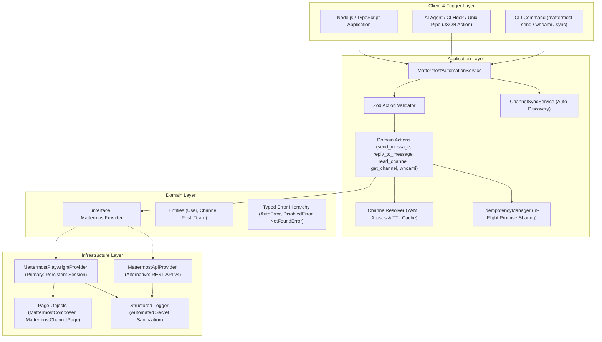

<div align="center">

# Mattermost Personal Account Automation

**Production-grade, modular automation service and CLI for interacting with Mattermost using your personal identity.**

[](https://www.typescriptlang.org/)
[](https://nodejs.org/)
[](https://vitest.dev/)
[](https://playwright.dev/)
[](https://opensource.org/licenses/MIT)

<p align="center">
  <a href="#-why-this-exists">Why This Exists</a> •
  <a href="#-architecture">Architecture</a> •
  <a href="#-features">Features</a> •
  <a href="#-quick-start">Quick Start</a> •
  <a href="#-yaml-channel-mapping">Channel Mapping</a> •
  <a href="#-cli-reference">CLI Reference</a> •
  <a href="#-web-dashboard--api-gateway">Web UI & API Gateway</a> •
  <a href="#-scheduled-cron-jobs">Cron Jobs</a> •
  <a href="#-model-context-protocol-mcp">MCP Server (AI Agents)</a> •
  <a href="#-typescript-sdk">TypeScript SDK</a> •
  <a href="#-security">Security</a> •
  <a href="#-testing">Testing</a>
</p>

</div>

---

## 💡 Why This Exists

Most Mattermost automation tools rely on **Incoming Webhooks**, **Bot Accounts**, or **Personal Access Tokens (PAT)**. In corporate and enterprise environments, this presents major blockers:

1. **Permission Friction (Not Everyone is an Admin)**: Regular team members cannot generate Personal Access Tokens or create webhooks arbitrarily because workspace policies restrict these to administrators.
2. **Identity Attribution**: Messages sent via bot accounts or incoming webhooks look like impersonal bots, stripping away personal responsibility and developer context (e.g. who made the PR or deployed the fix).
3. **SSO & MFA Obstacles**: Corporate instances often require Google Workspace / Okta / SAML login with MFA, which standard script-based HTTP bots cannot bypass without administrative API tokens.

**Mattermost Personal Account Automation** solves this by prioritizing a **Zero-Admin Browser Automation Layer (Playwright)** as the primary default strategy, with direct API support as a fast alternative:

* **🌟 Strategy 1 — Persistent Browser Context (Playwright — Primary & Default)**:
  * Zero admin privileges required.
  * Works for **any** corporate user with a standard Mattermost account.
  * Full support for SSO (Google, Okta, GitLab, SAML) and Multi-Factor Authentication (MFA).
  * You log in manually once via `npm run cli -- login`. The session is securely saved locally and reused headless.
* **⚡ Strategy 2 — REST API v4 (Personal Access Tokens — Optional Alternative)**:
  * For power users or environments where Personal Access Tokens are explicitly permitted.

---

## 🏗 Architecture

The system enforces strict separation of concerns across Domain, Infrastructure, Application, and Client layers:



---

## ✨ Features

| Feature | Description |
| :--- | :--- |
| **Zero-Admin Setup** | Uses persistent Playwright session by default so standard non-admin users can automate without tokens or webhook creation. |
| **Personal Account Attribution** | All posts, replies, and channel operations appear authentically as your personal Mattermost user. |
| **Auto Channel Discovery** | Auto-discovers all channels across teams on login and generates `channels.yml` with `enabled: true/false` toggles. |
| **Dual Provider Support** | Primary Playwright provider + optional high-speed REST API v4 provider via configuration switch. |
| **Smart Channel Resolution** | Accepts channel names (`engineering`), YAML aliases (`backend-dev`), slugs (`~engineering`), or 26-char IDs. |
| **Idempotency & Deduplication** | In-flight execution lock and cached response store prevents duplicate messages during retry storms. |
| **Identity Verification Lock** | Startup self-check verifies identity against `MATTERMOST_EXPECTED_USER_ID`, preventing unintended execution. |
| **Zero Credential Leaks** | Automated regex scrubbing masks Bearer tokens, cookies, passwords, and session data in logs, errors, and CLI outputs. |
| **AI Agent / CLI Integration** | Native JSON action interface supporting standard Unix pipes (`echo '{...}' \| mattermost action`). |

---

## 🚀 Quick Start

### 1. Prerequisites
- **Node.js**: `v18.0.0` or higher
- **npm**, **pnpm**, or **bun**

### 2. Installation
```bash
git clone https://github.com/egagofur/Mattermost-Agent.git
cd Mattermost-Agent
npm install
```

### 3. Configuration
Copy `.env.example` to `.env`:
```bash
cp .env.example .env
```

Set your Mattermost server URL:
```env
MATTERMOST_URL=https://mattermost.example.com
MATTERMOST_PROVIDER=playwright
```

### 4. One-Time Login & Auto Channel Discovery
Authenticate once using the interactive login helper:
```bash
npm run cli -- login
```
A browser window will open. Complete your standard login (including Google/Okta SSO or MFA). Once completed, the session is saved to `data/mattermost-browser/` and all your accessible channels are automatically synced to `channels.yml`!

---

## 🔑 Authentication Setup

### Strategy 1 — Persistent Browser Session (Playwright — Primary & Default)
Recommended for **all users** (no administrator privileges needed):
1. Keep `MATTERMOST_PROVIDER=playwright` in `.env`.
2. Run:
   ```bash
   npm run cli -- login
   ```
3. Complete your login in the browser window.
4. From then on, all commands (`send`, `read`, `sync`, etc.) run headlessly in the background using your authenticated profile.

### Strategy 2 — Personal Access Token (API Provider — Optional Alternative)
For users whose Mattermost installation permits generating Personal Access Tokens:
1. Set `MATTERMOST_PROVIDER=api` in `.env`.
2. Generate a token under **Settings** $\rightarrow$ **Security** $\rightarrow$ **Personal Access Tokens**.
3. Set `MATTERMOST_TOKEN=<your_token>` in `.env`.

---

## 📁 YAML Channel Mapping & Auto-Discovery

Instead of configuring channels one-by-one, use **Auto-Discovery** to fetch all accessible channels across all your teams and generate `channels.yml` with toggles!

### 1. Auto-Discover & Generate `channels.yml`
Run the sync command:
```bash
npm run cli -- sync
```
Output:
```text
🔍 Discovering all accessible channels from Mattermost...

✅ Channels Synchronized Successfully!
   File:       channels.yml
   Discovered: 24 channels across 3 team(s)
   Status:     24 enabled, 0 disabled

-------------------------------------------------------------
   🟢 [ENABLED]  town-square          ➔ #town-square (team: engineering-team)
   🟢 [ENABLED]  engineering          ➔ #engineering (team: engineering-team)
   🟢 [ENABLED]  backend-dev          ➔ #dotify-backend-dev (team: dot-dev)
   🟢 [ENABLED]  qa-alerts            ➔ #automated-qa-reports (team: quality-assurance)
-------------------------------------------------------------
💡 You can now easily toggle 'enabled: true/false' in 'channels.yml'.
```

### 2. Enable / Disable Channels in `channels.yml`
Simply toggle `enabled: false` for channels you do not wish automation to post to:
```yaml
default_team: engineering-team
fallback_channel: town-square

channels:
  engineering:
    channel: engineering
    team: engineering-team
    enabled: true
    description: "Main team channel"

  backend-dev:
    channel: dotify-backend-dev
    team: dot-dev
    enabled: true

  # Disabled channel (safe from accidental automation posts)
  secret-project:
    channel: secret-project
    team: confidential-team
    enabled: false

# Environment overlays (activated via MATTERMOST_ENV or --env)
environments:
  prod:
    backend-dev:
      channel: dotify-backend-prod
      team: dot-prod
```
> [!NOTE]
> Re-running `mattermost sync` will automatically discover new channels while **preserving your existing `enabled: false` toggles and custom descriptions**.

### 3. Inspecting Active Aliases
```bash
npm run cli -- aliases
```

---

## 💻 CLI Reference

Run via `npm run <script> -- <args>` or `npm run cli -- <command>`:

```text
Usage: mattermost [options] [command]

Commands:
  whoami                             Verify personal identity and display current account
  send [channel] [message]           Send a message (e.g. `send per-fe-an "Hello"`)
  reply [channel] [rootId] [message] Reply to a thread (supports :1, :latest, --find, permalink)
  threads [channel] [query]          List & search active threads in a channel
  channels [query]                   List & search configured channels in channels.yml
  enable <channel>                   Enable a channel in channels.yml
  disable <channel>                  Disable a channel in channels.yml
  read [channel]                     Read recent messages from a channel
  sync                               Auto-discover all accessible channels from server
  login                              Open browser window for manual login (Playwright)
  action [jsonPayload]               Execute a domain action via JSON or stdin
```

### 🧵 Thread Discovery & Smart Replying

Finding thread IDs is now effortless. You no longer need to copy random 26-character hashes!

#### 1. Inspect Active Threads
```bash
npm run threads -- per-fe-an
```
```text
🧵 Active Threads in #per-fe-an (11 threads):
-----------------------------------------------------------------------------------------
[1] pyo47np3djgqjdpgq8xrrmdwiw • 8m ago • (0 replies)
    "Testing user-friendly positional syntax!"

[2] 31ewigbaoigepj5qsh3xb9bbjo • 15m ago • (2 replies)
    "Testing from Mettermost Agent"
    ↳ Last reply (10m ago): "Ini balasan di thread"
-----------------------------------------------------------------------------------------
```

#### 2. Reply via Numbered Shortcut (`:1`, `:latest`)
```bash
# Reply to the most recent thread in the channel:
npm run reply -- per-fe-an :1 "Approved and ready to merge!"
npm run reply -- per-fe-an :latest "Approved and ready to merge!"
```

#### 3. Reply by Searching Message Keywords (`--find` / `-f`)
```bash
# Finds the thread mentioning "Standup" and replies there automatically:
npm run reply -- per-fe-an --find "Standup" "Hadir, update task hari ini aman"
```

#### 4. Reply via Mattermost Permalink URL
```bash
npm run reply -- "https://mattermost.example.com/core/pl/31ewigbaoigepj5qsh3xb9bbjo" "Looks good to me!"
```

#### 5. Reply to the Last Sent Message (`--last`)
```bash
npm run send -- per-fe-an "Deployment started..."
npm run reply -- per-fe-an --last "Deployment completed successfully! ✅"
```

---

### 🏷️ AI & Automation Attribution Footer

To maintain transparency and ensure team members know whether a message was sent manually by the person or by an AI / CI tool, use the `from` property:

```bash
# Add custom attribution footer:
npm run send -- per-fe-an "MR !123 is ready for review." --from "AI"
npm run send -- per-fe-an "Pipeline #45 passed" --from "GitLab CI"
```
**Rendered message in Mattermost:**
> MR !123 is ready for review.
> 
> *~ from AI*

* **Set Default via `.env`**: `MATTERMOST_DEFAULT_FROM=AI`
* **Suppress attribution**: Pass `--no-from` in CLI.
* **JSON Action / AI Agent**:
  ```json
  {
    "action": "send_message",
    "channel": "per-fe-an",
    "message": "PR is ready for review.",
    "from": "AI Agent"
  }
  ```

#### Read Recent Channel Posts
```bash
npm run cli -- read engineering --limit 5
```

#### Direct JSON Action / AI Agent Pipe
```bash
echo '{"action":"send_message","channel":"engineering","message":"Automated deployment completed."}' | npm run cli -- action
```
JSON Response:
```json
{
  "success": true,
  "data": {
    "id": "post_123456789",
    "channelId": "chan_engineering_id",
    "userId": "usr_egagofur",
    "message": "Automated deployment completed.",
    "createdAt": "2026-08-24T10:45:00.000Z"
  }
}
```

---

## 🤖 Mattermost Agent & Task Executor Layer (Hermes-Ready Architecture)

A modular Mattermost integration layer that allows an AI agent to be triggered by mentioning a configured `@username`.

Mattermost acts as the communication interface, while task execution is decoupled behind a clean `AgentExecutor` abstraction. This enables **MockAgentExecutor** for development/testing today, with a direct plug-in point for **Hermes** later.

```text
Mattermost (Personal Account @ega)
       │
       ▼ (Poll Loop every N seconds)
Mattermost Listener
       │
       ▼
Mention Detection (checks @username boundary)
       │
       ▼
Thread Context Formatter (recent messages in thread)
       │
       ▼
AgentTask (Normalized Task Object)
       │
       ▼
AgentExecutor (Interface)
   ├── MockAgentExecutor (Now - for dev/testing)
   └── HermesAgentExecutor (Later - plugged in cleanly)
       │
       ▼
AgentResult (success, message, metadata)
       │
       ▼
Mattermost Reply (anchored to rootPostId in same thread)
       │
       ▼
Track Generated Post ID in State (Prevent Self-Loop)
```

---

### 🌟 Key Design Invariants

1. **Personal Account Identity**: The agent uses the **same** Mattermost account as the human user (via Personal Access Token).
2. **Intentional Self-Triggering**: A message authored by the human account owner (e.g. `@ega explain event-driven architecture`) **MUST trigger** the agent. Messages from the authenticated user are never automatically ignored.
3. **Agent Self-Loop Prevention**: To prevent infinite agent loops (where the agent responds to its own generated posts), the agent explicitly records every `post_id` it creates in local state (`agent_generated_post_ids`) and ignores those posts on subsequent polls.
4. **Decoupled Task Boundary (`AgentTask`)**: The Mattermost listener does not know how Hermes works or what model it uses. It constructs an `AgentTask` and hands it to the executor.

---

### 🧩 Domain Types & Interfaces

#### 1. `AgentTask`
```typescript
export interface ThreadMessage {
  author: string;
  message: string;
  timestamp?: number;
  userId?: string;
}

export interface AgentTask {
  id: string;
  instruction: string;
  threadContext: ThreadMessage[];
  channelId: string;
  rootPostId: string;
  sourcePostId: string;
  requestedBy: string;
  createdAt: string;
}
```

#### 2. `AgentExecutor` & `AgentResult`
```typescript
export interface AgentResult {
  success: boolean;
  message: string;
  metadata?: Record<string, unknown>;
}

export interface AgentExecutor {
  execute(task: AgentTask): Promise<AgentResult>;
}
```

#### 3. `MockAgentExecutor` (Development & Testing)
```typescript
export class MockAgentExecutor implements AgentExecutor {
  async execute(task: AgentTask): Promise<AgentResult> {
    return {
      success: true,
      message: `Mock executor response: ${task.instruction}`,
    };
  }
}
```

---

### 🔌 Future Hermes Integration Point

When Hermes is ready, create `HermesAgentExecutor` implementing `AgentExecutor`:

```typescript
// Example future Hermes adapter:
export class HermesAgentExecutor implements AgentExecutor {
  async execute(task: AgentTask): Promise<AgentResult> {
    // Invoke Hermes CLI/API with task.instruction and task.threadContext
    const result = await hermesClient.run(task);
    return {
      success: true,
      message: result.output,
    };
  }
}
```

Then plug it into `createDefaultExecutor()` in `src/agent.ts` or pass it into `runAgent(new HermesAgentExecutor())`. The Mattermost listener and mention detection logic remain 100% untouched.

---

### ⚙️ Configuration (.env)

```bash
# Mattermost Server URL & Personal Access Token
MATTERMOST_URL=https://mattermost.example.com
MATTERMOST_TOKEN=your_personal_access_token_here

# Trigger username without @ (e.g. ega -> triggers on `@ega ...`)
MATTERMOST_USERNAME=ega

# Polling Interval in seconds (Default: 5)
MATTERMOST_POLL_INTERVAL=5

# AI Provider: openai, gemini, or mock (Default: mock)
AI_PROVIDER=mock
# OPENAI_API_KEY=your_openai_api_key_here
# GEMINI_API_KEY=your_gemini_api_key_here

# Local state file
STATE_FILE_PATH=./data/agent-state.json
```

### 🚀 Running the Agent

```bash
# Start the Agent listener:
npm run agent

# Or via CLI:
mattermost agent --username ega --interval 5
```

### 🧪 Running Tests

```bash
# Run all unit tests:
npm test

# Run tests in watch mode:
npm run test:watch
```

---

## 🌐 Web Dashboard & REST API Gateway

`mattermost-agent` includes a high-density, interactive **Web Dashboard** and **REST API Gateway** for direct developer integrations.

```bash
# Launch the Web Dashboard & API Gateway on port 3000:
npm run ui

# Or via CLI:
mattermost ui --port 3000
```
Open **`http://localhost:3000`** in your browser to access the dashboard!

### 🌟 Dashboard Features
1. **1-Click Auto Login**: Trigger interactive Playwright browser login directly from the web UI with live progress indicators.
2. **Channel & Thread Explorer**: Visual thread tree viewer with `:1`, `:2` shortcuts and quick reply box.
3. **Cron Job Manager**: Visual schedule overview with next run countdowns, 1-click manual execution, and enable/disable switches.
4. **Interactive API Playground**: Live sandbox with multi-language code snippets (**cURL**, **TypeScript / Node.js**, **Python**, **Go**, **PHP**) and real-time response viewer.
5. **Live Activity Console**: Real-time Server-Sent Events (SSE) stream for message events, auth state, and cron executions.

### 📡 Ready-to-Use REST API Endpoints

| Method | Endpoint | Description |
| :--- | :--- | :--- |
| `GET` | `/api/status` | Get session connection & authenticated user state |
| `POST` | `/api/auth/login` | Trigger 1-Click interactive browser login |
| `GET` | `/api/channels` | List configured channels, aliases, and enabled flags |
| `POST` | `/api/channels/sync` | Re-sync accessible channels across all teams |
| `POST` | `/api/channels/toggle` | Enable or disable a channel dynamically |
| `GET` | `/api/threads?channel=:c` | Get active channel threads with `:1` shortcuts |
| `POST` | `/api/messages/send` | Send a top-level message with attribution (`from`) |
| `POST` | `/api/messages/reply` | Reply to thread via ID, `:1` shortcut, or query |
| `GET` | `/api/messages/history?channel=:c` | Read recent messages from a channel |
| `GET` | `/api/cron` | List configured recurring cron jobs |
| `POST` | `/api/cron/run` | Manually trigger a cron job execution |
| `POST` | `/api/cron/toggle` | Enable or disable a cron job |
| `GET` | `/api/openapi.json` | Download OpenAPI 3.0 specification |

#### Example: Send Message via cURL
```bash
curl -X POST http://localhost:3000/api/messages/send \
  -H "Content-Type: application/json" \
  -d '{
    "channel": "town-square",
    "message": "Hello from Mattermost Agent REST API!",
    "from": "Webhook Agent"
  }'
```

---

## ⏰ Scheduled Cron Jobs

`mattermost-agent` includes a declarative **Cron Scheduler Engine** for running recurring reminders, automated standup prompts, healthchecks, and periodic team syncs directly under your personal account.

### 1. Configuration (`cron.yml`)
Create a `cron.yml` file (template available at `cron.example.yml`):

```yaml
default_timezone: Asia/Jakarta

jobs:
  # Daily standup prompt every Mon-Fri at 09:00 WIB
  daily-standup:
    schedule: "0 9 * * 1-5"
    channel: per-fe-an
    message: "Selamat pagi rekan-rekan! Jangan lupa isi daily standup hari ini ya."
    from: "Daily Reminder"
    enabled: true
    timezone: Asia/Jakarta
    description: "Daily engineering standup prompt"

  # Weekly demo sync reminder every Friday at 16:00 WIB
  weekly-demo-reminder:
    schedule: "0 16 * * 5"
    channel: town-square
    message: "Reminder: Demo sprint & weekly sync akan dimulai dalam 30 menit."
    from: "Sprint Bot"
    enabled: true

  # Hourly healthcheck ping (disabled by default)
  healthcheck:
    schedule: "0 * * * *"
    channel: devops
    message: "Routine healthcheck ping."
    enabled: false
```

### 2. CLI Cron Management

```bash
# List all configured jobs, schedules, and next calculated run times:
npm run cron:list

# Start the continuous scheduler daemon worker:
npm run cron:start

# Trigger an immediate single test run of a job:
npm run cli -- cron run daily-standup

# Enable or disable a job dynamically in cron.yml:
npm run cli -- cron enable healthcheck
npm run cli -- cron disable healthcheck
```

---

## 🤖 Model Context Protocol (MCP) Server for AI Agents

`mattermost-agent` includes a built-in **MCP Server** over standard I/O (`stdio`), allowing AI coding assistants and agents (**Cursor**, **Claude Desktop**, **Antigravity**, **Windsurf**, **Claude Code**, etc.) to directly read and send Mattermost messages as your personal user!

### ⚙️ Client Configurations

#### 1. Cursor IDE (`.cursor/mcp.json` or Settings > MCP)
```json
{
  "mcpServers": {
    "mattermost": {
      "command": "node",
      "args": ["/ABSOLUTE/PATH/TO/mattermost-agent/dist/mcp/index.js"],
      "env": {
        "MATTERMOST_URL": "https://mattermost.example.com",
        "MATTERMOST_PROVIDER": "playwright",
        "MATTERMOST_DEFAULT_FROM": "AI Agent"
      }
    }
  }
}
```

#### 2. Claude Desktop (`claude_desktop_config.json`)
* **macOS**: `~/Library/Application Support/Claude/claude_desktop_config.json`
* **Windows**: `%APPDATA%\Claude\claude_desktop_config.json`
```json
{
  "mcpServers": {
    "mattermost": {
      "command": "node",
      "args": ["/ABSOLUTE/PATH/TO/mattermost-agent/dist/mcp/index.js"]
    }
  }
}
```

#### 3. Google Antigravity / Gemini CLI (`~/.gemini/config/mcp_config.json`)
```json
{
  "mcpServers": {
    "mattermost": {
      "command": "node",
      "args": ["/ABSOLUTE/PATH/TO/mattermost-agent/dist/mcp/index.js"]
    }
  }
}
```

#### 4. Windsurf IDE (`~/.codeium/windsurf/mcp_config.json`)
```json
{
  "mcpServers": {
    "mattermost": {
      "command": "node",
      "args": ["/ABSOLUTE/PATH/TO/mattermost-agent/dist/mcp/index.js"]
    }
  }
}
```

#### 5. Claude Code CLI
```bash
claude mcp add mattermost -- node /ABSOLUTE/PATH/TO/mattermost-agent/dist/mcp/index.js
```

#### 6. VS Code (Cline / Roo Code Extensions)
Add to your extension settings (`cline_mcp_settings.json`):
```json
{
  "mcpServers": {
    "mattermost": {
      "command": "node",
      "args": ["/ABSOLUTE/PATH/TO/mattermost-agent/dist/mcp/index.js"],
      "disabled": false,
      "autoApprove": []
    }
  }
}
```

### 🛠️ Exposed MCP Tools

| Tool Name | Description |
| :--- | :--- |
| `mattermost_whoami` | Verify authenticated identity (username, user ID, email, roles). |
| `mattermost_list_channels` | List all discovered & configured channels with enabled status and aliases. |
| `mattermost_get_threads` | List active threads in a channel with preview, reply counts, and `:1` shortcuts. |
| `mattermost_send_message` | Send a new message to a channel with optional sender attribution (`from`). |
| `mattermost_reply_thread` | Reply to a thread via shortcut (`:1`, `:latest`), keyword (`find`), permalink, or ID. |
| `mattermost_read_channel` | Read recent channel posts and thread replies. |
| `mattermost_sync_channels` | Auto-discover all channels across teams and sync to `channels.yml`. |
| `mattermost_list_cron_jobs` | List configured cron jobs, schedules, and next run calculations. |
| `mattermost_run_cron_job` | Trigger an immediate test execution of a specific cron job. |
| `mattermost_toggle_cron_job` | Enable or disable a cron job dynamically in `cron.yml`. |

---

## 📦 TypeScript SDK Usage

Integrate Mattermost personal account automation directly into your Node.js/TypeScript services:

```typescript
import { MattermostAutomationService, loadConfig } from 'mattermost-agent';

async function main() {
  // 1. Initialize service with environment or custom config
  const service = new MattermostAutomationService();

  // 2. Startup identity check (optional fail-fast)
  const me = await service.whoami();
  console.log(`Authenticated as @${me.username} (${me.id})`);

  // 3. Post a message to a channel (resolves name automatically)
  const post = await service.sendMessage({
    channel: 'engineering',
    message: '🚀 CI Build #120 passed all integration tests.',
  });
  console.log(`Message sent: ${post.id}`);

  // 4. Reply to the created thread
  await service.replyToMessage({
    channel: 'engineering',
    rootId: post.id,
    message: 'Artifacts available at: https://ci.example.com/build/120',
  });

  // 5. Read recent posts from a channel
  const { channel, messages } = await service.readChannel({
    channel: 'engineering',
    limit: 10,
  });
  console.log(`Read ${messages.length} messages from #${channel.displayName}`);

  // 6. Execute structured domain action (AI agent / webhook format)
  const actionResult = await service.executeAction({
    action: 'send_message',
    channel: 'engineering',
    message: 'Triggered from agent workflow.',
    idempotencyKey: 'event-unique-id-9988',
  });

  if (actionResult.success) {
    console.log('Action success:', actionResult.data);
  } else {
    console.error(`Action failed [${actionResult.error?.code}]: ${actionResult.error?.message}`);
  }

  // 7. Cleanup
  await service.close();
}

main().catch(console.error);
```

---

## 🛡 Security & Privacy Principles

1. **Zero Secret Logging**: Tokens, Bearer headers, session cookies, and passwords are automatically redacted by the logger and error formatting layer before output.
2. **No Password Storage**: The system never asks for, stores, or automates password inputs.
3. **Session Isolation**: Playwright browser profile files (`data/mattermost-browser/`) and `.env` configuration files are explicitly ignored in `.gitignore`.
4. **Idempotent Retries**: Network retries are only performed for transient errors (e.g. `502`, `503`, `429`, timeout) with exponential backoff and jitter, preventing duplicate post spam.
5. **Identity Guard**: Optional `MATTERMOST_EXPECTED_USER_ID` or `MATTERMOST_EXPECTED_USERNAME` prevents the automation from executing if the active credentials belong to an unexpected account.

---

## 🧪 Testing

The codebase includes a test suite covering configuration parsing, action schemas, channel resolution, idempotency locks, API client status mapping, and browser provider fallbacks.

```bash
# Run all unit and integration tests
npm test

# Run tests in watch mode
npm run test:watch

# Run TypeScript typecheck
npm run typecheck

# Build distribution bundle
npm run build
```

---

## 🤝 Contributing

Contributions, issues, and feature requests are welcome! Feel free to check the [issues page](https://github.com/egagofur/Mattermost-Agent/issues).

1. Fork the repository
2. Create your feature branch (`git checkout -b feat/amazing-feature`)
3. Commit your changes (`git commit -m 'feat: add amazing feature'`)
4. Push to the branch (`git push origin feat/amazing-feature`)
5. Open a Pull Request

---

## ⭐ Show Your Support

If this tool helped you or your team automate Mattermost without admin headache, please consider giving it a ⭐️ on [GitHub](https://github.com/egagofur/Mattermost-Agent)!

---

## 📄 License

This project is licensed under the [MIT License](LICENSE).
Distributed as open source software to empower developers and engineering teams worldwide.
